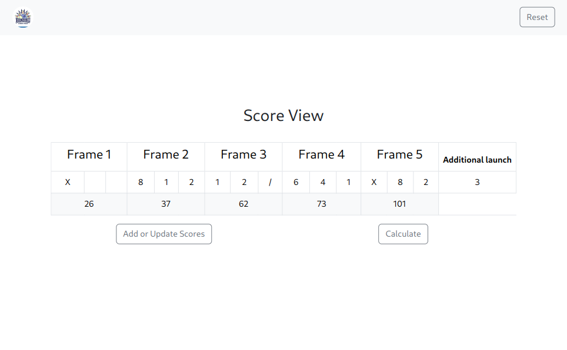

# African bowling

This application is a technical test from [Code & Scale](https://codeandscale.com/). It's a point calculation application for an African game similar to bowling, but with different rules.

You can find the project subject with the game rules [here](https://github.com/micael-jerry/african-bowling/blob/dev/docs/Test%20technique%20-%20Code%26Scale.docx.pdf).

## Getting Started

Follow these steps to get started:

- Clone the Repository:

```bash
git clone https://github.com/micael-jerry/african-bowling.git
```

- Install dependencies

```bash
npm install
```

- Run

```bash
npm run dev
```

## Linter

```bash
npm run lint
```

## Code formatting

- **Check code format**

```bash
npm run check-prettier
```

- **Format Code**

```bash
npm run prettify
```

## App user guide

### Step 1

- First, add a score by pressing the **`"Add Score"`** button


### Step 2

- You must now fill in the form correctly and save it.
- **NB**: To fill in the additional launch for frame 5, select *`"Additional launch"`* on ***Frame number*** and *`"1"`* on **Launch number**


### Step 3

- After saving the form for the first time, you will see a score table.


- You need to complete the table bit by bit with the form by pressing the **`"Add or Update Scores"`** button.


### Step 4

- Only after you have completed the table as shown in the image above, press the **`"Calcuate"`** button to get the score result.


